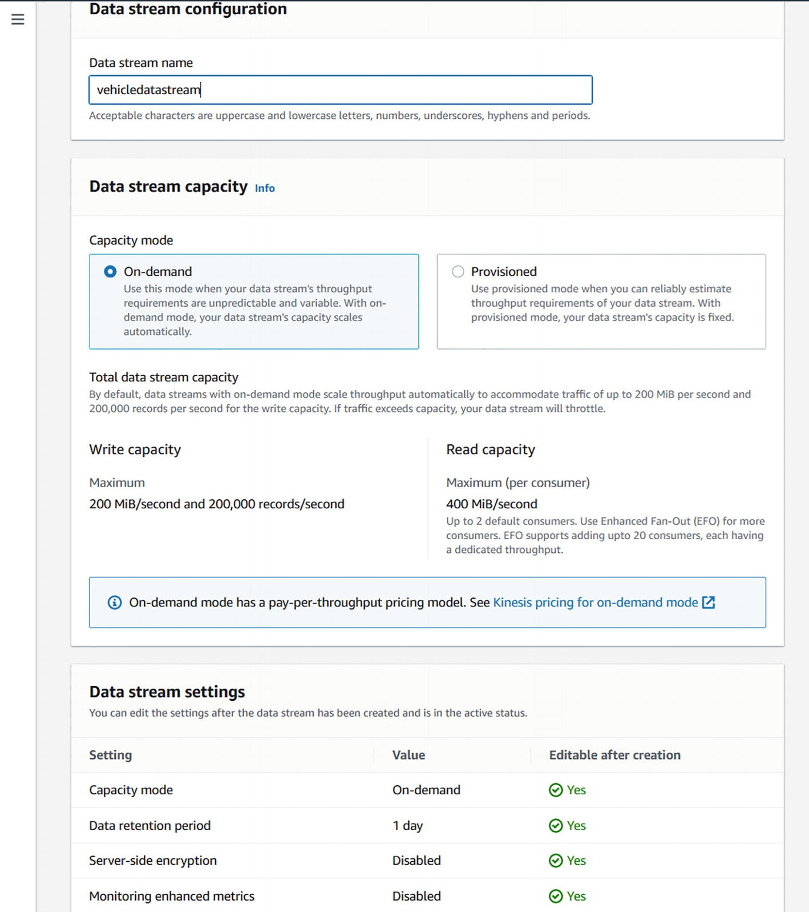
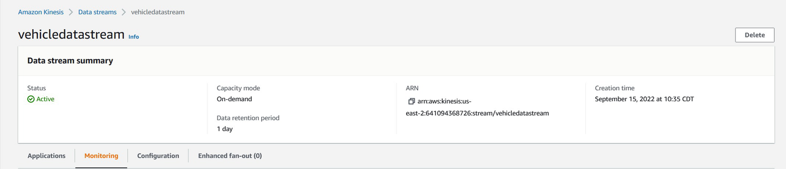
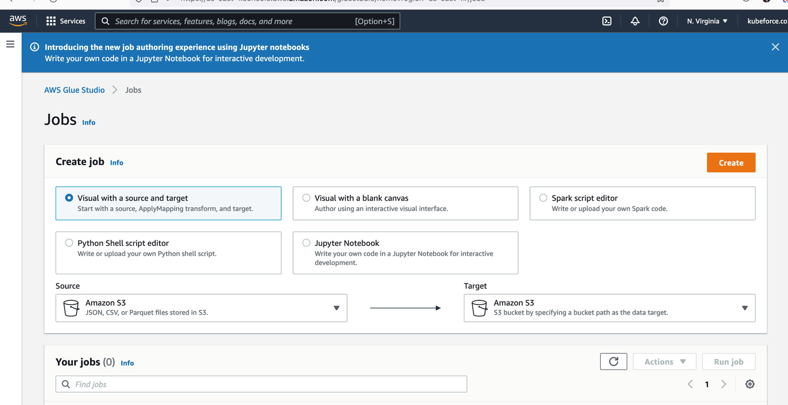
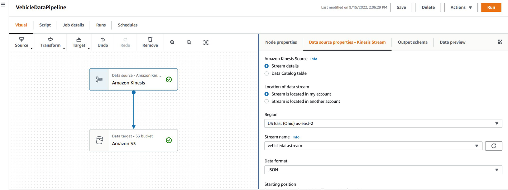
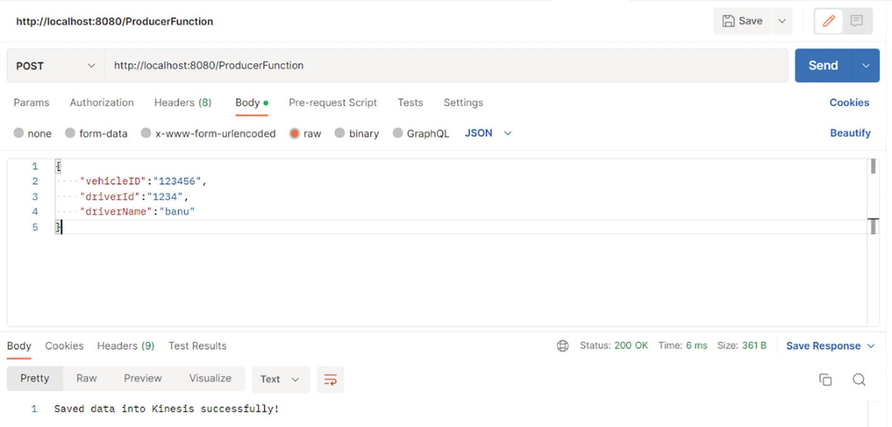
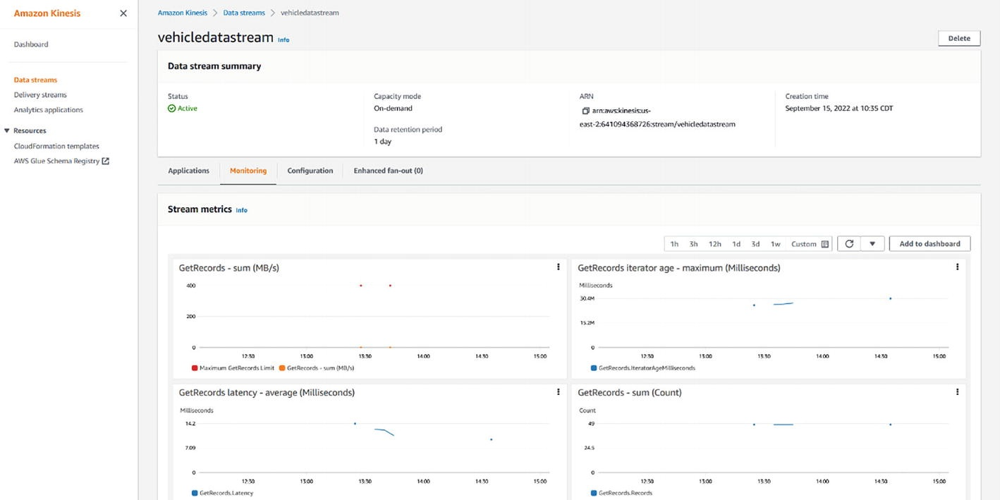
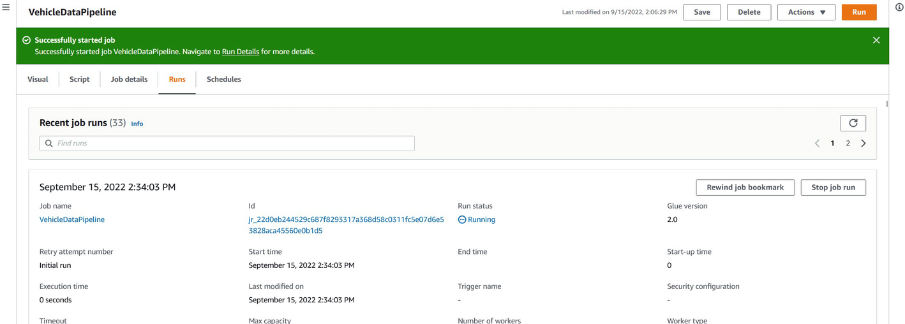

# Spring Cloud Function and AWS Glue
AWS Glue works very similarly to Spring Cloud Data Flow in that you can wire up a data pipeline that has a source, processor, and sink. More information can be found at https://us-east-2.console.aws.amazon.com/gluestudio/home?region=us-east-2#/.

Spring Cloud Function can participate in the data pipeline process as a trigger, or simply by integrating with one of the components in the data pipeline.

For example, if you have AWS Kinesis as a source and you need to get data from a vehicle, you can have Spring Cloud Function stream the data that it gets into AWS Kinesis.

In the example in this section, you will be publishing data into AWS Kinesis and then kick off an AWS Glue job manually.

The flow will be:

Spring Cloud Function ➤ Kinesis ➤ AWS Glue Job ➤ S3

The prerequisites are:
* Subscription to AWS, AWS Glue job, Kinesis, and S3
* AWS Glue job with Kinesis as the source and S3 as the target
* Code from GitHub at https://github.com/banup-kubeforce/Kinesis_trigger.git

It is assumed that you have some knowledge of AWS Glue, as we do not delve into the details of this product. The focus is on creating the Spring Cloud Function.

## Step 1: Set Up Kinesis
You can get to Kinesis at https://us-east-1.console.aws.amazon.com/kinesis/home?region=us-east-1#/home.

Once you subscribe to Kinesis, you can begin creating the data stream. Make sure you select on-demand (see Figure 4-21), as this will save you some money.   

> Figure 4-21 Create a vehicledatastream in AWS Kinesis

   
> Figure 4-22 vehicledatastream is active

You can now connect and publish to the stream using your Spring Cloud Function.

## Step 2: Set Up AWS Glue
You can access the AWS Glue Studio at https://us-east-1.console.aws.amazon.com/gluestudio/home?region=us-east-1#/.

Once you have the subscription, you can begin creating a glue job.

Go to the AWS Glue Studio to start the creation of the glue job, as shown in Figure 4-23.

  

> Figure 4-23 AWS Glue Studio, Create a Job   
Create a job called vehicledatapipeline. Use Amazon Kinesis as the source and Amazon S3 as the target. Ensure that you set the proper configurations for each of these components.

The job shown in Figure 4-24 will read Amazon Kinesis shards and post the data into Amazon S3.


> Figure 4-24 Configure Kinesis and S3 integration

Now you have a job in AWS Glue that you can trigger manually or via a function.

## Step 3: Create a Function to Load Data into Kinesis
1. Set the application properties. Make sure that you provide the stream name. AWS information has to be set, as shown in Listing 4-6.
    ```propertis
    spring.cloud.function.definition=producerFunction
    #use your aws credentials here
    aws.access_key =
    aws.secret_key =
    aws.region = us-east-2
    #use your stream name that you have created
    aws.stream_name = vehicledatastream
    ```
    > Listing 4-6 application.properties

2. Add the kinesis dependencies. Make sure to add the necessary libraries. The latest version of producer has some bugs, so I used the working version, as shown in Listing 4-7.
    ```xml
    <dependency>
        <groupId>com.amazonaws</groupId>
        <artifactId>amazon-kinesis-client</artifactId>
        <version>1.14.1</version>
    </dependency>
    <dependency>
        <groupId>com.amazonaws</groupId>
        <artifactId>amazon-kinesis-producer</artifactId>
        <version>0.13.1</version>
    </dependency>
    <dependency>
        <groupId>com.amazonaws</groupId>
        <artifactId>amazon-kinesis-client</artifactId>
        <version>1.14.1</version>
    </dependency>
    ```
    > Listing 4-7 pom.xml dependecies
3. Create the model. This is a [simple model for tracking a vehicle’s detail](./src/main/java/com/kubeforce/kinesis_trigger/TrackDetail.java). See Listing 4-8.

4. Create the Kinesis producer. [This interface is nice to have](./src/main/java/com/kubeforce/kinesis_trigger/ProducerService.java); see Listing 4-9.
5. Create the producer implementation. [The implementation provided in Listing 4-10 sets the method for posting to Kinesis](./src/main/java/com/kubeforce/kinesis_trigger/ProducerServiceImpl.java).
6. Create the producer function. This is the critical function that will be exposed to post data into Kinesis; see Listing 4-11.
    ```java
    import com.fasterxml.jackson.core.JsonProcessingException;
    import com.fasterxml.jackson.databind.ObjectMapper;
    import org.springframework.beans.factory.annotation.Autowired;
    import java.util.function.Function;
    public class ProducerFunction implements Function<TrackDetail,String> {
        @Autowired
        private ProducerService producerService;
        @Override
        public String apply(TrackDetail trackDetail) {
            ObjectMapper mapper = new ObjectMapper();
            String data = "";
            try {
                data = mapper.writeValueAsString(trackDetail);
                producerService.putDataIntoKinesis(data);
            } catch (JsonProcessingException e) {
                e.printStackTrace();
            } catch (Exception e) {
                e.printStackTrace();
            }
            return "Saved data into Kinesis successfully!";
        }
    }
    ```
    > Listing 4-11 ProducerFunction.java
7. Run the function; see Figure 4-25.
    ```bash
    2024-12-16T07:42:45.991+08:00  INFO 9068 --- [           main] c.k.k.KinesisTriggerApplication          : Starting KinesisTriggerApplication using Java 17.0.12 with PID 9068 (D:\Data\workspaces\STS-4.26.0\apress-practical-spring-cloud-function-developing-2023_aws-Kinesis_trigger\target\classes started by robert0714 in D:\Data\workspaces\STS-4.26.0\apress-practical-spring-cloud-function-developing-2023_aws-Kinesis_trigger)
    2024-12-16T07:42:45.993+08:00  INFO 9068 --- [           main] c.k.k.KinesisTriggerApplication          : No active profile set, falling back to 1 default profile: "default"
    2024-12-16T07:42:46.761+08:00  INFO 9068 --- [           main] o.s.b.w.embedded.tomcat.TomcatWebServer  : Tomcat initialized with port 8080 (http)
    2024-12-16T07:42:46.772+08:00  INFO 9068 --- [           main] o.apache.catalina.core.StandardService   : Starting service [Tomcat]
    2024-12-16T07:42:46.773+08:00  INFO 9068 --- [           main] o.apache.catalina.core.StandardEngine    : Starting Servlet engine: [Apache Tomcat/10.1.33]
    2024-12-16T07:42:46.840+08:00  INFO 9068 --- [           main] o.a.c.c.C.[Tomcat].[localhost].[/]       : Initializing Spring embedded WebApplicationContext
    2024-12-16T07:42:46.841+08:00  INFO 9068 --- [           main] w.s.c.ServletWebServerApplicationContext : Root WebApplicationContext: initialization completed in 811 ms
    2024-12-16T07:42:47.610+08:00  INFO 9068 --- [           main] o.s.b.w.embedded.tomcat.TomcatWebServer  : Tomcat started on port 8080 (http) with context path '/'
    2024-12-16T07:42:47.617+08:00  INFO 9068 --- [           main] c.k.k.KinesisTriggerApplication          : Started KinesisTriggerApplication in 1.898 seconds (process running for 2.228)
    ```
    > Figure 4-25 Successful run of the function
8. Test with Postman. Run a POST-based test against ProducerFunction to publish data into Kinesis.
   Add text that introduces and gives context to Figure 4-26.    
    
   > Figure 4-26 Postman test  
   You will get a message that the data is saved.
   ```json
   {
    "vehicleId": "123456",
    "driverId": "1234",
    "driverName":"nanu"
    }
   ```
9. Check Kinesis for data. This information can be found on the Kinesis dashboard under Monitoring, as shown in Figure 4-27.   
    
   > Figure 4-27 Kinesis dashboard showing the data metrics  
10. Run Glue manually. From the Glue Studio, start the process by clicking Run, as shown in Figure 4-24.
    The job starts to run, as shown in Figure 4-28. Check the `s3` bucket for any data.  
       
    > Figure 4-28 The Glue job run

In this section, you learned how to create a Spring Cloud Function that can post data into AWS Kinesis that is part of the data pipeline. You learned that you can publish data into Kinesis and trigger the AWS Glue pipeline manually, but I also encourage you to explore other ways you can implement Spring Cloud Function for AWS Glue, such as creating and deploying triggers. More information on how to create AWS Glue triggers in Spring is available at https://docs.aws.amazon.com/sdk-for-java/latest/developer-guide/examples-glue.xhtml.